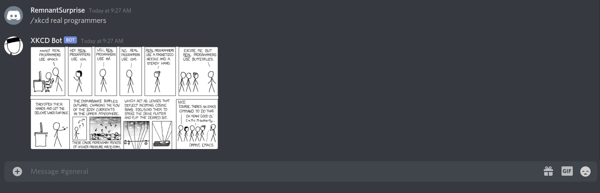

# XKCD Discord Bot

A Discord bot designed to retrieve XKCD comics based on given keywords.

Based off the idea that there's an XKCD comic for everything, this bot lets users easily post XKCD comics in Discord channels.

## Built With
* JavaScript
* Node.js

## Usage 

First, add the bot to a server using this [link](https://discord.com/api/oauth2/authorize?client_id=841341366780952596&permissions=52224&scope=bot).

Afterwards, enter `/xkcd KEYWORDS` in a message to get the XKCD bot to search for relevant XKCD comics.

## Screenshot

## Methodology

The search is conducted by searching the [Explain XKCD](https://www.explainxkcd.com/wiki/index.php/Main_Page) wiki
first for any matching titles. Afterwards, it searches for any keyword matches in the explanations for each comic, which should help
retrieve any thematically relevant comics.

## License
[MIT](https://choosealicense.com/licenses/mit/)

